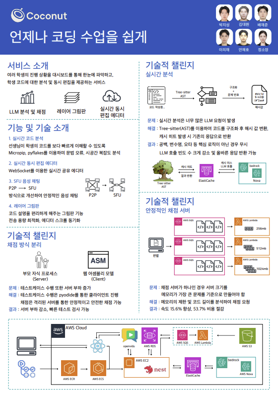

# 🥥 Coconut: 언제나 코딩 수업을 쉽게

 

## 🎯 프로젝트 목표 (문제 정의)

기존의 온라인 코딩 수업에서는 다음과 같은 어려움이 있었습니다.

- **교사**: 여러 학생의 코드를 개별적으로 확인하고 피드백을 주는 과정이 번거롭고, 학생들의 진행 상황을 종합적으로 파악하기 어렵습니다.
- **학생**: 선생님의 피드백을 기다리는 시간이 길어지고, 말로만 전달되는 설명을 즉시 이해하기 어렵습니다.

Coconut은 이러한 문제들을 실시간 기술로 해결하여, 온라인 코딩 과외의 질을 한 단계 높이는 것을 목표로 합니다.

 

## ✨ 주요 기능 (Key Features)

### 1. 교사 대시보드 및 수업 관리

- **수업 생성/참여**: 간단한 정보 입력으로 수업을 생성하고, 공유된 코드로 학생들이 쉽게 참여할 수 있습니다.
- **실시간 학생 모니터링**: 그리드 뷰를 통해 모든 학생의 문제 풀이 현황('통과', '실패', '진행중', '없음')을 실시간으로 파악합니다.
- **음성 채팅**: WebRTC(SFU) 기반의 음성 통화 기능으로 원활한 커뮤니케이션을 지원합니다.
- **문제 관리**: 데이터베이스에 저장된 문제를 카테고리별로 검색하고, 수업에 쉽게 추가하거나 삭제할 수 있습니다.

### 2. 실시간 협업 및 코드 분석

- **실시간 동시 편집**: 특정 학생의 작업 환경에 접속하여, 학생의 코드를 실시간으로 보면서 직접 수정하거나 주석을 다는 등 1:1 과외를 진행할 수 있습니다.
- **정적/동적 코드 분석**:
  - **정적 분석**: Micropip, Pyflakes를 통해 코드의 문법 오류, 변수 사용 등을 실시간으로 검사합니다.
  - **LLM 기반 동적 분석**: 학생이 코드를 작성하는 동안, 비효율적인 로직이나 흐름을 AI가 지속적으로 분석하여 개선 방안을 제안합니다.
- **레이어 그림판**: 교사가 에디터 위에 직접 그림을 그리며 특정 코드 라인을 강조하거나 로직의 흐름을 시각적으로 설명할 수 있습니다.

### 3. 이중 채점 시스템

- **클라이언트 채점**: 학생이 답안을 제출하기 전, WebAssembly(Pyodide)를 통해 브라우저 내에서 빠르게 테스트케이스를 실행해볼 수 있습니다. (서버 부하 없음)
- **서버 채점**: 최종 제출 시, 안전하게 격리된 별도의 채점 서버로 코드를 보내 정식 채점을 진행하고, 종합적인 LLM 코드 분석 리포트를 함께 생성합니다.

### 4. 자동화된 수업 리포트

- 수업 종료 후, 문제별/학생별 정답률, 제출 내역 등 모든 활동이 기록된 종합 리포트가 자동으로 생성됩니다.
- 교사는 리포트를 마이페이지에 저장하여, 이후 수업 개선을 위한 데이터로 활용할 수 있습니다.

 

## 🛠️ 기술 스택 (Tech Stack)

#### **Frontend**

- React, TypeScript, Vite, Tailwind CSS, Zustand
- Socket.IO Client, Framer Motion, Lottie, Pyodide (WebAssembly)

#### **Backend**

- NestJS, TypeScript, TypeORM, Socket.IO
- Class-validator, Passport, Bcrypt
- **Code Analysis**: Web-tree-sitter, Micropip, Pyflakes

#### **Database & Cache**

- MySQL (on AWS RDS)
- Redis (on AWS ElastiCache)

#### **DevOps & Cloud**

- Docker, Docker Compose, Nginx
- **AWS**: EC2, S3, RDS, ECR, ECS, SQS, Lambda, Bedrock

 

## 🚀 기술적 챌린지 및 해결 과정

### 1. LLM 코드 분석 비용 및 속도 문제

- **문제**: 학생이 코드를 입력할 때마다 LLM API를 호출하면 비용과 시간 문제가 발생합니다.
- **해결**: Tree-sitter를 사용해 코드의 **AST(추상 구문 트리)**를 분석하고, 구조가 변경될 때만 해시 값을 갱신했습니다. 변수명 변경 등 비구조적인 수정은 캐시된 결과를 반환하여 LLM API 호출을 **획기적으로 줄이고 응답 속도를 개선**했습니다.

### 2. 채점 서버의 자원 낭비 문제

- **문제**: 문제마다 요구하는 메모리 사양이 다른데, 단일 채점 서버는 가장 큰 문제에 맞춰야 해 비효율적이었습니다.
- **해결**: 메모리 요구량에 따라 **Light, Middle, Heavy 세 단계로 채점 인프라를 분리**했습니다. **AWS SQS**로 채점 요청을 큐에 넣고, 문제 크기에 맞는 **AWS Lambda** 함수가 이를 처리하는 분산 아키텍처를 구축했습니다.
- **결과**: > 2,000개 요청 테스트 기준, **채점 속도는 15.6% 향상**되었고 **비용은 53.7% 절감**되었습니다.

 

## 🧑‍💻 팀원 소개 (Team)

| 이름              |
| :---------------- |
| **박지성** (팀장) |
| **김대원**        |
| **이의재**        |
| **안채호**        |
| **정소영**        |
| **배재준**        |
